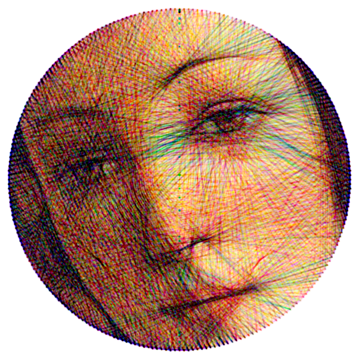

## StringArt.jl

<p align="center">
  
</p>

This script implements a simplified version of the [String Art](https://en.wikipedia.org/wiki/String_art) greedy algorithm. Given an image, it attempts to create a similar representation using a single thread wound around a circle of nails, effectively constructing an image using only lines. This technique is probably most well-know for the artistic works of [Petros Vrllis](https://www.saatchiart.com/vrellis).

Most implementations often require high-contrast images, and still the results can vary significantly from one image to another. In this version, I've tweaked the algorithm parameters to **enhance the contrast and detail in the final output**. While this adjustment impacts performance, it remains usable.

Additionally, the script features a command-line interface (CLI) with various tweakable parameters, option flags, **RGB color mode** and you can also save the **GIF animation** with easy. Feel free to explore these options to customize the output according to your preferences, if you want to reuse the code or call it somewhere else, you should look at `StringArt.run`.

### Quick Start

**1. Install Julia and packages:**
```bash
# Install Julia (Linux)
sudo snap install julia --classic

# Install required packages
julia -e 'using Pkg; Pkg.add(["ArgParse", "Images", "LRUCache", "FileIO", "ImageIO", "ImageMagick", "Clustering"])'
```

**2. Run your first string art:**
```bash
# Basic usage
julia -O3 -t 1 main.jl -i your_image.jpg -o result

# High quality with SVG output
julia -O3 -t 1 main.jl -i your_image.jpg -o result -s 600 -n 240 --steps 2000 --svg
```

**3. Check the results:**
- `result.png` - Final string art image
- `result.svg` - Vector format (if --svg flag used)
- `result_sequence.txt` - Instructions for physical creation

**Useful Resources:**

- [The Mathematics of String Art Video](https://www.youtube.com/watch?v=WGccIFf6MF8)

### Algorithm

1. **Setup:**

- Load the source image and create an empty output image.
- Calculate pin positions and all possible lines between 2 pins.

2. **Iteration Step:**

- Choose a pin (P).
- Create all possible lines connecting P to the other pins in the circle.
- Calculate the error between each lines and the source image.
- Find the line (L) that gives the minimum error.
- Update the output image adding L, and the source image subtracting L.
- Set the pin to be opposite point in the line L.

**Line Generating Function:**
One-pixel-width lines (or any square/stair-like lines) do not yield good results. Experimentation with different line functions is essential here. I ended up choosing to apply the Gaussian Blur Kernel to the line. It's simple, and it works (also, it eliminates the need to fine-tune other parameters).

**Line Pixel Strength:**
Opt for low line pixel values to create nuanced shades of gray in the output image.

**Choose Pin:**
Randomizing the pin position periodically (every N steps) tends to give better results.

**Error Function:**
Arguably the most critical part of the algorithm. You should minimize the error here and not any other metric (I lost a lot of time doing that...). The best function that I found was the squared difference between the source image and the line (but the performance takes a considerable hit here).

**Excluding Already Visited Lines:**
While excluding used lines each iteration improves performance, it results in a more diffuse and noisy image. In this implementation, visited lines are retained. If you prefer the noisy style, just change the variable `EXCLUDE_REPEATED_PINS` to true.

### Requirements

**System Requirements:**
- Julia 1.6+ (recommended: Julia 1.8+)
- Linux, macOS, or Windows
- At least 4GB RAM (8GB+ recommended for large images)

**Required Julia Packages:**
- ArgParse
- Images
- LRUCache
- FileIO
- ImageIO
- ImageMagick
- Clustering

(if you get ERROR "Package not found" then simply run 
`julia -e 'using Pkg; Pkg.update(); Pkg.add("PackageName")'`)

### Installation

#### 1. Install Julia

**Linux (Ubuntu/Debian):**
```bash
# Using snap (recommended)
sudo snap install julia --classic

# Verify installation
julia --version
```

**Alternative Linux installation:**
```bash
# Using apt (Ubuntu/Debian)
sudo apt update
sudo apt install julia

# Or download from official website
wget https://julialang-s3.julialang.org/bin/linux/x64/1.8/julia-1.8.5-linux-x86_64.tar.gz
tar -xzf julia-1.8.5-linux-x86_64.tar.gz
sudo mv julia-1.8.5 /opt/julia
sudo ln -s /opt/julia/bin/julia /usr/local/bin/julia
```

**macOS:**
```bash
# Using Homebrew
brew install julia

# Or download from official website
# https://julialang.org/downloads/
```

**Windows:**
Download and install from: https://julialang.org/downloads/

#### 2. Install Required Packages

Open Julia REPL and install the required packages:

```julia
julia -e 'using Pkg; Pkg.add(["ArgParse", "Images", "LRUCache", "FileIO", "ImageIO", "ImageMagick", "Clustering"])'
```

Or manually in Julia REPL:
```julia
julia> using Pkg
julia> Pkg.add("ArgParse")
julia> Pkg.add("Images")
julia> Pkg.add("LRUCache")
julia> Pkg.add("FileIO")
julia> Pkg.add("ImageIO")
julia> Pkg.add("ImageMagick")
julia> Pkg.add("Clustering")
```

#### 3. Clone/Download the Project

```bash
git clone <repository-url>
cd stringart-julia
```

### Usage

#### Basic Command Structure

```bash
julia -O3 -t [threads] main.jl [options] -i [input_image] -o [output_name]
```

**Command Line Flags Explained:**
- `-O3`: Maximum optimization level for Julia compilation
- `-t [threads]`: Number of threads to use (start with 1 if experiencing lag)
- `-i`: Input image path
- `-o`: Output filename (without extension)

#### Performance Tips

**Thread Usage:**
- Start with `-t 1` if your system lags or crashes
- Increase threads gradually: `-t 2`, `-t 4`, `-t 8`
- More threads = faster processing but higher memory usage
- For large images (>800px), consider using fewer threads

**Memory Management:**
- Large images require more RAM
- Reduce `--steps` if running out of memory
- Use smaller `--size` for initial testing

#### Examples

**Basic Usage:**
```bash
# Simple grayscale conversion
julia -O3 -t 1 main.jl -i portrait.jpg -o result

# High quality with custom settings
julia -O3 -t 1 main.jl \
  -i my_portrait.jpg \
  -o final_result \
  -s 600 \
  -n 360 \
  --steps 5000 \
  --line-strength 18 \
  --svg
```

**Different Output Formats:**
```bash
# PNG only (default)
julia -O3 -t 1 main.jl -i input.jpg -o output

# PNG + SVG
julia -O3 -t 1 main.jl --svg -i input.jpg -o output

# PNG + GIF animation
julia -O3 -t 1 main.jl --gif -i input.jpg -o output

# All formats
julia -O3 -t 1 main.jl --svg --gif -i input.jpg -o output
```

**Color Modes:**
```bash
# Grayscale (default)
julia -O3 -t 1 main.jl -i input.jpg -o output

# RGB mode (red, green, blue)
julia -O3 -t 1 main.jl --rgb -i input.jpg -o output

# Custom colors
julia -O3 -t 1 main.jl --custom-colors "#FFFF33,#33FFFF,#FF33FF" -i input.jpg -o output

# Extract palette from image (4 colors)
julia -O3 -t 1 main.jl --palette 4 -i input.jpg -o output
```

**Quality Settings:**
```bash
# High quality (slower)
julia -O3 -t 1 main.jl -s 800 -n 300 --steps 3000 -i input.jpg -o output

# Fast preview
julia -O3 -t 1 main.jl -s 400 -n 120 --steps 500 -i input.jpg -o output

# Balanced
julia -O3 -t 1 main.jl -s 600 -n 180 --steps 1500 -i input.jpg -o output
```

#### Parameter Recommendations

**For Different Image Sizes:**
- **Small images (300-400px)**: `-s 400 -n 120 --steps 800`
- **Medium images (500-600px)**: `-s 600 -n 180 --steps 1500` 
- **Large images (700-800px)**: `-s 800 -n 240 --steps 2500`
- **Very large images (900px+)**: `-s 1000 -n 300 --steps 3000`

**For Different Quality Levels:**
- **Quick preview**: `--steps 500 --line-strength 30`
- **Good quality**: `--steps 1500 --line-strength 25`
- **High quality**: `--steps 3000 --line-strength 20`
- **Maximum quality**: `--steps 5000 --line-strength 18`

#### Troubleshooting

**Common Issues:**

1. **System Lagging/Crashing:**
   ```bash
   # Reduce threads
   julia -O3 -t 1 main.jl [options]
   
   # Reduce image size
   julia -O3 -t 1 main.jl -s 400 [other options]
   
   # Reduce steps
   julia -O3 -t 1 main.jl --steps 500 [other options]
   ```

2. **Out of Memory:**
   ```bash
   # Use fewer pins
   julia -O3 -t 1 main.jl -n 120 [other options]
   
   # Smaller image size
   julia -O3 -t 1 main.jl -s 400 [other options]
   ```

3. **Poor Quality Results:**
   ```bash
   # Increase steps
   julia -O3 -t 1 main.jl --steps 3000 [other options]
   
   # Adjust line strength
   julia -O3 -t 1 main.jl --line-strength 15 [other options]
   
   # More pins for detail
   julia -O3 -t 1 main.jl -n 300 [other options]
   ```

4. **Slow Processing:**
   ```bash
   # Increase threads gradually
   julia -O3 -t 2 main.jl [options]
   julia -O3 -t 4 main.jl [options]
   
   # Reduce quality for speed
   julia -O3 -t 1 main.jl --steps 1000 [other options]
   ```

### Creating Physical String Art

The algorithm generates a `_sequence.txt` file with step-by-step instructions for creating physical string art:

1. **Prepare Materials:**
   - Wooden board or canvas
   - Nails (number specified in output)
   - Thread or string
   - Hammer
   - Compass or protractor

2. **Setup:**
   - Draw a circle on your board
   - Hammer nails evenly around the circle (numbered 0 to N-1)
   - Start from nail 0 (top of circle)

3. **Follow Instructions:**
   - Tie thread to the START nail
   - Follow the sequence: wrap thread around each specified nail
   - **Never cut the thread** - use one continuous piece
   - Tie off at the END nail

4. **Tips:**
   - Use different colored threads for RGB mode
   - Keep thread tension consistent
   - Work slowly and carefully
   - The sequence file shows exact nail numbers to use

### Debugging Utilities

```bash
# plot pins used in the image
julia utils.jl -f plot_pins -i [input image] -o [output image]

# plot color channel for a given color and input image
julia utils.jl -f plot_colors --colors "#FF0000" -i [input image] -o [output image]

# plot all chords from first pin
julia utils.jl -f plot_chords -i [input image] -o [output image]
```

### Complete Parameter Reference

#### Required Parameters
- `-i, --input INPUT`: Path to input image (JPG, PNG, etc.)

#### Optional Parameters

**Output Settings:**
- `-o, --output OUTPUT`: Output filename without extension (default: "output")
- `--gif`: Save animated GIF showing creation process
- `--svg`: Save vector SVG format for scaling
- `--verbose`: Show detailed progress information

**Image Quality:**
- `-s, --size SIZE`: Output image size in pixels (default: 512)
  - Recommended: 400-800 for good quality/speed balance
  - Maximum: 1000 (may cause memory issues)
- `-n, --pins PINS`: Number of nails around circle (default: 180)
  - More pins = more detail but slower processing
  - Recommended: 120-300
  - Maximum: 500 (may cause memory issues)
- `--steps STEPS`: Algorithm iterations (default: 1000)
  - More steps = better quality but slower
  - Recommended: 1000-3000 for good results
- `--line-strength LINE-STRENGTH`: Line intensity 1-100 (default: 25)
  - Lower values = finer details
  - Higher values = bolder lines
- `--blur BLUR`: Gaussian blur kernel size (default: 1)
  - Smooths lines for better appearance
  - Keep at 1 for most cases

**Color Modes:**
- `--rgb`: Use red, green, blue channels
- `--custom-colors COLORS`: Custom HEX colors (e.g., "#FF0000,#00FF00,#0000FF")
- `--palette N`: Extract N colors from input image using k-means clustering

#### Performance Guidelines

**Memory Usage:**
- Image size × pins × steps = memory requirement
- Keep total under 2GB for smooth operation
- Reduce any parameter if running out of memory

**Processing Time:**
- Small images (400px): 1-5 minutes
- Medium images (600px): 5-15 minutes  
- Large images (800px): 15-45 minutes
- Very large images (1000px): 30+ minutes

**Quality vs Speed:**
- **Fast preview**: `-s 400 -n 120 --steps 500`
- **Good quality**: `-s 600 -n 180 --steps 1500`
- **High quality**: `-s 800 -n 240 --steps 2500`
- **Maximum quality**: `-s 1000 -n 300 --steps 5000`

#### Example Commands

```bash
# Quick test
julia -O3 -t 1 main.jl -i photo.jpg -o test -s 400 --steps 500

# High quality portrait
julia -O3 -t 1 main.jl -i portrait.jpg -o result -s 600 -n 240 --steps 2000 --svg

# RGB color mode
julia -O3 -t 1 main.jl --rgb -i photo.jpg -o color_result -s 500 --steps 1500

# Custom colors
julia -O3 -t 1 main.jl --custom-colors "#FFD700,#FF69B4,#00CED1" -i photo.jpg -o custom

# Extract palette
julia -O3 -t 1 main.jl --palette 5 -i photo.jpg -o palette_result -s 600
```

### Gallery

<p align="center">
  
</p>

<p align="center">
  
</p>

<p align="center">
  
</p>

#### RGB Mode

<p align="center">
  
</p>

<p align="center">
  
</p>

<p align="center">
  
</p>

#### Animation

<p align="center">
  
</p>

---

### FAQ (Frequently Asked Questions)

**Q: Why does my system lag or crash?**
A: Start with `-t 1` (single thread) and smaller image sizes. Gradually increase threads and size as your system handles it.

**Q: How long does processing take?**
A: Depends on image size and steps:
- 400px: 1-5 minutes
- 600px: 5-15 minutes  
- 800px: 15-45 minutes
- 1000px: 30+ minutes

**Q: What's the best image size for quality vs speed?**
A: 600px with 180 pins and 1500 steps gives excellent results in reasonable time.

**Q: Can I use any image format?**
A: Yes, Julia supports JPG, PNG, TIFF, and other common formats.

**Q: How do I create physical string art?**
A: The algorithm generates a `_sequence.txt` file with step-by-step nail instructions. Follow it exactly with one continuous thread.

**Q: What's the difference between RGB and palette modes?**
A: RGB uses fixed red/green/blue channels. Palette mode extracts colors from your image for more accurate representation.

**Q: Why are my results blurry?**
A: Increase `--steps` for more iterations, or reduce `--blur` parameter.

**Q: Can I pause and resume processing?**
A: No, but you can reduce `--steps` for faster previews, then increase for final quality.

**Q: What if I run out of memory?**
A: Reduce image size (`-s`), pins (`-n`), or steps (`--steps`). Use `-t 1` for single-threaded processing.

**Q: How do I get better quality?**
A: Increase `--steps` (3000+), use more pins (`-n 300`), and lower `--line-strength` (15-20).


